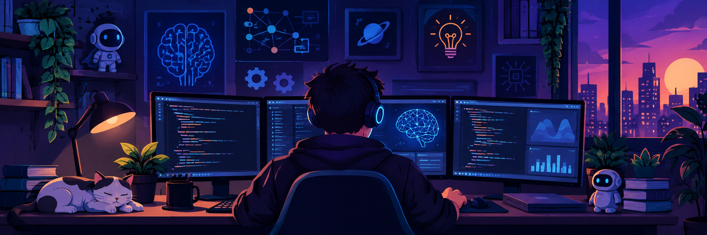

  

<h1 align="center">Hi 👋, I'm Shubham Kumar</h1>

* 🤖 Passionate about **Automation, Machine Learning, Artificial Intelligence, and Full-Stack Development**

* 🧠 Experienced with **Python, Machine Learning, Deep Learning, NLP, Computer Vision, and AI-powered applications**

* ⚙️ Building **automation workflows, intelligent systems, APIs, web applications, and ML pipelines**

* 🌐 Full-Stack Developer with experience in **MongoDB, Express.js, React.js, Node.js (MERN)**

* 💻 Experienced with **Flask, REST APIs, JavaScript, HTML, CSS, SQL, and MySQL**

* 🧪 Working with **Scikit-learn, Pandas, NumPy, PyTorch, TensorFlow, Transformers, OpenCV, and Hugging Face**

* 🔍 Interested in **AI Agents, LLMs, NLP, Computer Vision, Predictive Modeling, and Intelligent Automation**

* 🚀 Currently improving my skills in **Advanced ML, Generative AI, LLMs, MERN Stack, and Automation**

* 📂 Building practical projects combining **AI + Automation + Web Development**

* 📫 Reach me at **[shubii5463@gmail.com](mailto:shubii5463@gmail.com)**

* ⚡ Fun fact: **I love playing PC games. 👩‍🎨**

<h3 align="center">Areas of Interest</h3>

🔹 <b>Automation Engineering</b> — Web Automation, API Automation, Data Automation, Workflow Automation

 

🔹 <b>Machine Learning</b> — Supervised Learning, NLP, Computer Vision, Feature Engineering, Model Development

 

🔹 <b>AI Engineering</b> — Generative AI, LLMs, Transformers, AI Applications, Intelligent Systems

 

🔹 <b>Web Development</b> — MERN Stack, REST APIs, Full-Stack Applications

 

🔹 <b>Backend Development</b> — Python, Flask, Node.js, Express.js, SQL, MySQL

<h3 align="center">Languages & Tools</h3>

<h4 align="left">💻 Programming Languages</h4>

  <!-- Python -->
  

  <!-- JavaScript -->
  

  <!-- Java -->
  

  <!-- C -->
  

<h4 align="left">🤖 AI & Machine Learning</h4>

  <!-- PyTorch -->
  

  <!-- TensorFlow -->
  

  <!-- OpenCV -->
  

  <!-- Pandas -->
  

  <!-- NumPy -->
  

<h4 align="left">🌐 MERN & Web Development</h4>

  <!-- React -->
  

  <!-- Node.js -->
  

  <!-- Express -->
  

  <!-- MongoDB -->
  

  <!-- HTML -->
  

  <!-- CSS -->
  

  <!-- Bootstrap -->
  

<h4 align="left">⚙️ Backend & Automation</h4>

  <!-- Flask -->
  

  <!-- MySQL -->
  

  <!-- Selenium -->
  

  <!-- Git -->
  

  <!-- GitHub -->
  

  <!-- Postman -->
  

<h3 align="left">📊 GitHub Stats</h3>

---

